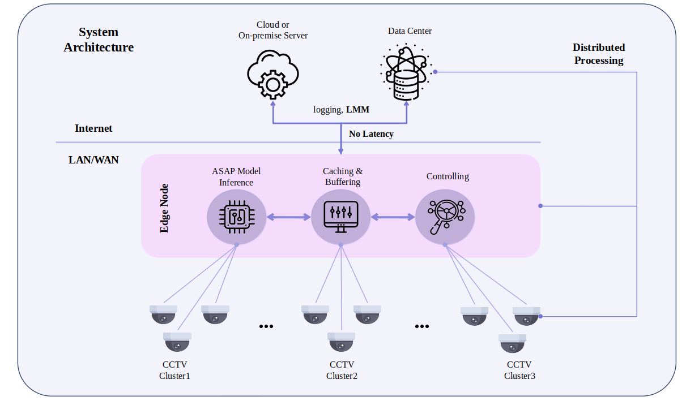
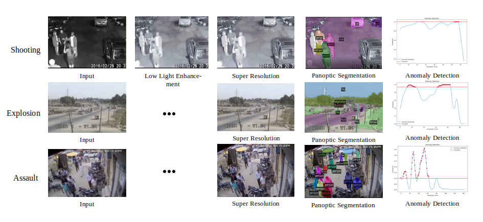
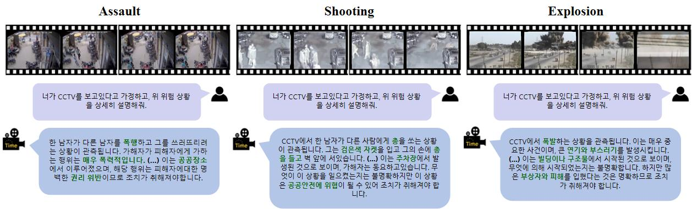

# ASAP(AI Situation Awareness and Propagation) 육군 창업 경진대회

---
## 모델 선정 기준
모델의 선정 기준은. Real-time이 가능하며 Zero-shot이 가능한 모델로 선정했습니다.

* [CaFM-Pytorch-ICCV2021](https://github.com/Neural-video-delivery/CaFM-Pytorch-ICCV2021) 
    * 비디오 초해상도 모델(Video Super Resolution). 비디오를 고화질로 바꾸는 역할을 담당합니다.
* [FastLLVE](https://github.com/Wenhao-Li-777/FastLLVE)
    * 저조도 개선 모델(Low-Light Video Enhancement). 저조도 비디오를 개선하는 역할을 담당합니다.
* [PEL4VAD](https://github.com/yujiangpu20/PEL4VAD)
    * 이상탐지 모델(Anomaly-Detection). 비디오에서 이상탐지를 담당합니다.
* [YOSO](https://github.com/hujiecpp/YOSO)
    * 판옵틱 분할(Panoptic Segmentation). 비디오에서의 객체를 인스턴스 단위로 분할해 인식하는 역할을 담당합니다.
* [VTimeLLM](https://github.com/huangb23/VTimeLLM)
    * 멀티모달 모델(Video-Multimodal). 비디오를 입력으로 받아 상황을 추론하는 역할을 담당합니다.

## 전체적인 모델 아처텍처

## 시스템 프로세스

* Origin Video
* Low-light Enhancement
* Video Super Resolution
* Panoptic Segmentation
* Anomaly Detection

 

## 멀티모달 결과

* Large Multi-modal Model

### 인공지능팀
* 일병 윤상우 (팀장)
* 상병 이현서

### 비지니스 팀
* 일병 박상욱
* 일병 심준용

### 참고자료
* Liu, Jiaming, et al. "Overfitting the data: Compact neural video delivery via content-aware feature modulation." *Proceedings of the IEEE/CVF International Conference on Computer Vision*. 2021.
* Huang, Bin, et al. "Vtimellm: Empower llm to grasp video moments." *arXiv preprint arXiv:2311.18445* 2 (2023).
* Pu, Yujiang, Xiaoyu Wu, and Shengjin Wang. "Learning prompt-enhanced context features for weakly-supervised video anomaly detection." *arXiv preprint arXiv:2306.14451* (2023).
* Li, Wenhao, et al. "FastLLVE: Real-Time Low-Light Video Enhancement with Intensity-Aware Look-Up Table." *Proceedings of the 31st ACM International Conference on Multimedia*. 2023.
* Gentry, Craig, et al. "Yoso: You only speak once: Secure mpc with stateless ephemeral roles." *Annual International Cryptology Conference*. Cham: Springer International Publishing, 2021.
* Polino, Antonio, Razvan Pascanu, and Dan Alistarh. "Model compression via distillation and quantization." arXiv preprint arXiv:1802.05668 (2018).
* Hadidi, Ramyad, et al. "Characterizing the deployment of deep neural networks on commercial edge devices." 2019 IEEE International Symposium on Workload Characterization (IISWC). IEEE, 2019.
* Hu, Yushi, et al. "Visual Program Distillation: Distilling Tools and Programmatic Reasoning into Vision-Language Models." arXiv preprint arXiv:2312.03052 (2023).
* Bor, Martin C., John Vidler, and Utz Roedig. "LoRa for the Internet of Things." Ewsn. Vol. 16. 2016.
* Li, Gen, et al. "Towards high-quality and efficient video super-resolution via spatial-temporal data overfitting." 2023 IEEE/CVF Conference on Computer Vision and Pattern Recognition (CVPR). IEEE, 2023.
